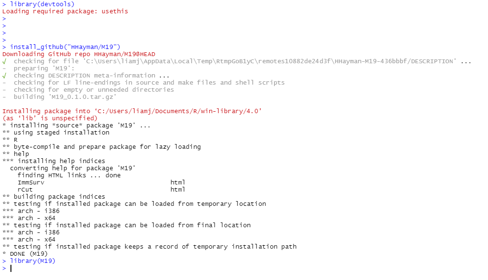
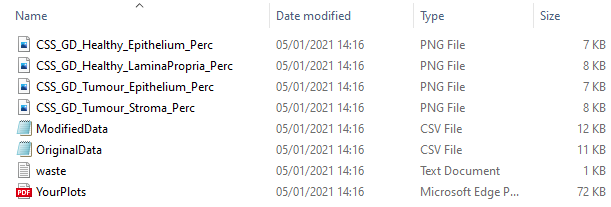

---
output:
  github_document: default
  pdf_document: default
---

<!-- README.md is generated from README.Rmd. Please edit that file -->

```{r, include = FALSE}
knitr::opts_chunk$set(
  collapse = TRUE,
  comment = "#>",
  fig.path = "man/figures/README-",
  out.width = "100%"
)
```

# M19

<!-- badges: start -->
<!-- badges: end -->

Use this package to generate cut-offs using the maximal rank statistic method.

## Installation

For generic installation and set-up of R Studio, please see guides [here](https://rstudio-education.github.io/hopr/starting.html) and [here](http://www.sthda.com/english/wiki/running-rstudio-and-setting-up-your-working-directory-easy-r-programming).

First install and load the 'devtools' package;

``` r
install.packages("devtools")
library(devtools)
```


Next, you need to install the 'gplots' package;

``` r
install.packages("gplots")
```


Finally, you need to install the 'M19' package;

``` r
install_github("HHayman/M19")
```



# rCut 
##Create cut-offs using the maximally selected rank statistic


## Preparing Data

You need to carry out any exclusions etc in your data set - include the minimum amount of data possible. Your final data should include columns such as (example); an identifier (TMA_ID), survival time(s) (CSS_Time), corresponding survival status(s) (CSS_status), your variables (CD8_Tumour, CD8_Healthy). 


Coding is based on those used in the Glasgow combined cohort, if your variables don't match, use the 'MISC' option or let me know.

CSS/OS should be coded as 0 = alive, 1 = CD, 2 = NCD. The function will split it into CSS and OS for you.
DFS considers values >0 to be an event.
RFS considers 1 to be a recurrence event.
MISC considers 1 a miscellaneous event, everything else becomes 0. You can use this with anything, but code your data appropriately.


First, you need to read your data file. It should be a CSV file with no spaces in the column names, use '_'. To import your data, use this code and use the pop up window to select your data file;

``` r
Data <- read.csv(file.choose(), fileEncoding = 'UTF-8-BOM')
```


## Produce Cut-Offs

Check your data file in R and if you're happy with it, edit and use the code below to call the function;

All variable names must match exactly. You'll get an error if they don't.

For CSS, OS, DFS, RFS and MISC, Use 'Yes' if you want that cut-off to be generated, and 'No' if you do not. It is case sensitive and an input is required. If you state 'No', you don't need to provide any other variables for that outcome.

For 'Survival', 'SurvivalStatus' and any other required time and status variables, replace the text within the quotation marks with your variable names. 

minprop sets a minimum proportion of cases to be included in any group. The default is 0.1, which is standard. 

PlotPalette determines the colour scheme. "SPSS" uses the colour scheme from SPSS, "Grayscale" is pseudo black and white.

Replace 'Variable1' etc with your variables. There is no limit so just add/remove arguments as appropriate.

If anything is unclear, ask, it's much better than having to redo your analysis :)

``` r 
rCut(Data, CSS = "Yes", OS = "Yes", DFS = "Yes", RFS = "Yes", MISC = "No", minprop = 0.1, PlotPalette = "SPSS", ID = "TMA_ID", Survival = "CSS_2017", SurvivalStatus = "a0cd1ncd2_2017", DiseaseFree = "DFSmonths", DiseaseFreeStatus = "DFS", Recurrence="DFSmonths", RecurrenceStatus="FOR", Variables = c("Variable1", "Variable2", "Variable3"))
```

When you get a message from Wonder Woman and the flashing vertical dash is back, the function has finished running. It might take a few seconds.


I suggest ignoring the output within R studio itself, but the bottom right pane of R studio will contain a copy of your plots. If you want to look at them within R studio, use the arrow on the left of the ribbon to cycle through the plots.


If you open your working directory folder you will find a folder named 'CutOffs_Data_#'. Every time you run the function you get a fresh folder in your working directory, numbered incrementally if a folder already exists.


Within the folder you will find your data;
* A pdf file named 'YourPlots' containing a text print of your cut offs and associated test statistic, and all of your plots
* Individual png copies of each plot for use in presentations etc. These are labeled based on your variables and event outcomes
* Two csv files, 'OriginalData' and 'ModifiedData'. These are copies of your original data and the modified version from the function. Leave them alone, they are just for future reference if you need to know exactly what data you used
* A txt file called 'Waste'. This is just a dump for anything that we don't send to the console, thus avoiding clutter. Ignore it





# SigStack
## Stack your mutational signatures for easy visual comparison.


## Preparing Data

You need to use MafTools to run comparisons between your groups, using MafCompare. You need to write the 'results' from the MafCompare to a CSV, and you must use write.csv2 or this will not work due to formatting issues. Do this for each comparison. As an example;

``` r
ComparisonFile <- mafCompare(m1 = Group1, m2 = Group2, m1Name = "Group1", m2Name = "Group2", minMut = 5)
write.csv2(ComparisonFile[["results"]], "ComparisonFile.csv")
``` 


## Creating your SigStack plots.

Create a folder within your working directory and in it place the files you just created, one for each comparison you want to stack. The function will stack all comparisons that you include in the subdirectory, so swap them in and out as you need to. Each group; in your SigStack plot is named using the name of your comparison files. You can then run the 'SigStack' function, as below;

``` r
SigStack(Subdirectory = "SubDirectory", OutputFileName = "OutputFileName", ORlow = "0.5", ORhigh = "2", pval = "0.1", Palette = "Greyscale")
``` 

*Subdirectory - A subdirectory of your working directory, in which you store your comparison files.
*OutputFileName - A name for your final outpt file.
*ORlow - The lower boundary for your OR. DMGs with an odds ratio between this value and your ORhigh will be excluded.Default value is 0.5.
*ORhigh - The upper boundary for your OR. DMGs with an odds ratio between this value and your ORlow will be excluded.Default value is 2.
*pval - Your chosen cut off for 'statistical significance'. Default value is 0.05.
*Palette - Choose your colour palette; greyscale, blue, red, pink, green. Default palette is greyscale.


